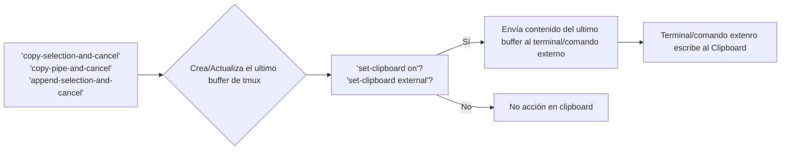

TMUX usa el archivo de configuración `~/.config/tmux/tmux.conf` el cual es un enlace simbólico a `~/.files/etc/tmux/tmux.conf`.


```bash
vim ~/.config/tmux/tmux.conf
vim ~/.config/tmux/custom_config.conf
```


# Consideraciones

- El archivo de configuración de tmux se ejecuta solo la primera vez que inicia el servidor tmux (cuando se crea la primera sesión).
- Si usa *contenedores interactivos* que comporten las variables de entorno del usuario actual y comparten el home del usuario (como contenedores **distrobox**) deberá modificar su profile para:
    - Eliminar dichas variables a  nivel contenedor para evitar conflictos.
    - Cambiar la ruta `TMUX_TMPDIR` para que los socket IPC del servidor tmux sea diferente al del contenedor (si no entraria en bucle).

```bash
vim ~/.custom_profile.bash
```


# Variables de entorno usadas

## Builtin de tmux

Antes de la creación del servidor tmux, se usa la variables de entorno (si existen):

- `TMUX_TMPDIR`

Durante la ejecución del servidor tmux, se *crea automáticamente* las siguiente variables de entorno (que solo pueden ser accedidas dentro panel de una sesión tmux):

- `TMUX`
    - A nivel de servidor tmux.

- `TMUX_PANE`
    - A nivel de panel tmux.

## Mis variables de entorno

Antes de la creación del servidor tmux, se usa las variables de entorno (si existen):

- `SET_CLIPBOARD`
    - Define como se calculara el modo en que TMUX de acceder al clipboard  (`TMUX_SET_CLIPBOARD`).
    - Valores:
        - Si no se define, se calculara automáticamente el modo en que TMUX de acceder al clipboard (`TMUX_SET_CLIPBOARD`).
        - `0`, si usa `set-clipboard off` (desactivar el escribir al clipboard).
        - `1`, si usa `set-clipboard on` y usar el `OSC52` para escribir en el clipboard.
        - `2`, si usa `set-clipboard external` y usar comandos externos para escribir en el clipboard.

- `TMUX_NESTED`
    - Si es establece como `0` (es *nested*) se cambia el keybinding para soporta
    - Valores
        - `0`: Si es nested
        - cualquier otro valor

- `MY_REPO_PATH`
    - Ruta donde esta el repositorio de mis *dotfiles*.
    - Este variable de entorno esta definido a nivel profile del usuario `~/.bashrc`, pero puede ser modificado usando `~/.custom_profile.bash`.
    - Si no se especifica se usa `$HOME/.files`.


```bash
# Forzar el uso de OSC52 en tmux
export SET_CLIPBOARD=1

# Indicar que es un tmux anidado
export TMUX_NESTED=0


# Iniciar tmux
tmux new-session -s main -n w01
```


Durante la ejecución del servidor tmux, se *crea automáticamente* las siguiente variables de entorno (que solo pueden ser accedidas dentro panel de una sesión tmux):

- `TMUX_PROGRAM`
    - Nombre y ruta del programa tmux. Ejemplo: `/usr/bin/tmux`
- `TMUX_SOCKET`
    -  Ruta de socket IPC del servidor tmux. Ejemplo: `/tmp/tmux-1000/default`
- `TMUX_CONF`
    - La ruta del archivo de configuracion principal.
    - No se usa la variable format `current_file` se define solo version >= 3.2 y solo es disponible si se usa dentro del archivo de configuración.

- `TMUX_CUSTOM_CONF`
    - Ruta del archivo de configuracion personalizable.
- `TMUX_SHELL_PATH`
    - Ruta donde estan los script requeridos para el setup
- `TMUX_VERSION`
    - Version de TMUX entero y comparable, por ejemplo `3.2a` convierte a `320`, `2.56` convierte a `256`, `2.506` convierte a `250`.

- `TMUX_SET_CLIPBOARD`
    - Es un valor auto-calculado e indica el modo en que TMUX de acceder al clipboard.
    - Su valor se calcula usando lo enviado en la variable `SET_CLIPBOARD`.
    - Sus valores posibles son:
        - Si no se determinar el valor adecuado
        - `0`, si usa `set-clipboard off` (desactivar el escribir al clipboard).
        - `1`, si usa `set-clipboard on` y usar el `OSC52` para escribir en el clipboard.
        - `2`, si usa `set-clipboard external` y usar comandos externos para escribir en el clipboard.

Dentro de un sesión de tmux, *no se deberá* modificar estas variables, son auto-generadas durante el inicio del servidor.


# Uso del clipboard

Cuando TMUX se integra con el clipboard, permite que cuando se cree un buffer tmux, automaticamente ese texto también se copie al clipboard del SO.

El script de configuración de tmux usado, por defecto intenta calcular el mejor mecanismo a usar para escribir en el clipboard (usando la función `setting_clipboard` del script `~/.filesshell/bash/bin/tmux/fun_general.bash`).

- Intenta determinar si su terminal soporta OSC-52. Si su terminal lo soporta ejecuta `set-clipboard on`.
- Si su terminal no lo soporta, busca un comando de backend de clipboard instalado. Si lo encuentra, usa `set-clipboard external`.

Si por algún motivo, el mecanismo automático no es deseado o no encuentra el valor correcto, puede establecer el valor correcto de la variable de entorno `SET_CLIPBOARD` antes iniciar la creación del servidor tmux (creación de la 1ra sesión tmux) y establecer:
- Si no se especifica intentara calcular el valor automáticamente:
- `0`, si usa `set-clipboard off` (desactivar el escribir al clipboard).
- `1`, si usa `set-clipboard on` y usar el `OSC52` para escribir en el clipboard.
- `2`, si usa `set-clipboard external` y usar comando externos para escribir en el clipboard.

```bash
# Forzar el uso de OSC52 en tmux
SET_CLIPBOARD=1 tmux new-session -s main -n w01

# Forzar el uso de OSC52 en tmux
export SET_CLIPBOARD=1
tmux new-session -s main -n w01
```


# Personalización

La personalización de tmux (para no modificar el dotfiles, debido `~/.config/tmux/tmux.conf` es un enlace simbólico al archivo del dotfiles), deberá usarse `~/.config/tmux/custom_config.conf `


```bash
vim ~/.config/tmux/custom_config.conf
```


## De *Vim tmux navigator*

El plugin de **Vim Tmux Navigator** crea keymapping para VIM que permite navegar entre splits vim y paneles tmux.

- URL : https://github.com/christoomey/vim-tmux-navigator

Para que se use el mismo keymappings tanto para VIM como para TMUX, en tmux se debera crear el keymapping `Ctrl + h/j/k/l` a nivel **root** (sin prefijo).

- Este keymapping solo deberá moverse entre paneles si dicho panel no ejecuta un **programa interactivo** que requieren procesar dichas key globales.
- Algunos **programas interactivos** que deben procesar el  `Ctrl + h/j/k/l`  y no permitir que tmux los procese son:
	- `vim` y nvim
        - Si usan el plugin 'vim-tmux-navegator' procesan dicha tecla y este es el decide si navegar entre split de vim y solo salir de este para irse a otro panel tmux.
    - `fzf`
        - Se requiere para navegacion o bindings interno.
    - `ssh` (en algunos casos)
        - Si dentro de `ssh` ejecuta tmux (inside) configurelo, para que la 'keys' se envie al 'tmux inside' y este a su vez reenvie a programas interactivos como `vim`, `nvim`, `fzf`.
        - Si dentro de `ssh` ejecuta vim, puede configurarlo.
        - Si dentro de `ssh` va ejecutar programas no interativos, no lo configure.


Lista de programas interactivos que estan en ejecucion del panel actual y requieren procesar las teclas `Ctrl + h/j/k/l`:

```bash
#Pare de un expresion regular de tipo '()', deonde '|' es un opcion y '?' representa un caracter.
set-option -g @interactive_prgs 'view|l?n?vim?x?|fzf|ssh'
set-option -g @interactive_prgs 'view|l?n?vim?x?|fzf'
```


## De *tmux fingers*


## De *url scan*


## De *url fzf*


## Del status-line de *oh my tmux*

Se usa *oh my tmux* para generar el *status-line* de tmux.

- *oh my tmux* usa variables de entorno que solo son usados durante el inicio del servidor tmux (por el proceso que ejecuta el archivo de configuracion durante el inicio y por sus procesos hijos).


## Otras

```bash
# Server Option> Habilitar el 'True Color' (24b colors) en tipo de pseudoterminal definidio
set-option -as terminal-overrides ',*256col*:Tc'
#set-option -as terminal-overrides ',xterm-256color:Tc'
#set-option -as terminal-overrides ',*:Tc'

# Server Option> Undercurl support
set-option -as terminal-overrides ',*:Smulx=\E[4::%p1%dm'

# Server Option> Underscore colours (tmux >= 3.0)
set-option -as terminal-overrides ',*:Setulc=\E[58::2::::%p1%{65536}%/%d::%p1%{256}%/%{255}%&%d::%p1%{255}%&%d%;m'

# Global Session Option> Definir el tipo de pseudo-terminal a usar (con soporte a 256-color)
set-option -g default-terminal 'tmux-256color'
#set-option -g default-terminal "${TERM}"

# Global Session Option> Increase history size
#set -g history-limit 10000

# Global Session Options> Start with mouse mode enabled
#set -g mouse on

# Global Session Options> Move status line to top
#set -g status-position top
```


# Keymappings


```bash
# Iniciar una sesion con configuracion por defecto (incluye 'default keymapping')
tmux -f /dev/null new-session -t mysession

# Listar lo definios en una tabla
tmux list-keys -T copy-mode-vi


tmux list-keys | grep 'select-pane'
```

Vease: https://github.com/tmux/tmux/wiki/Getting-Started#help-keys

Consideraciones:

- Por defecto el `<prefix>` es `ctrl + b`. Para mi caso, se cambiara
    - Usaremos `ctrl + a` para el tmux local (la tecla `a` y `ctrl` están mas cerca).
    - Usaremos `ctrl + b` para el tmux remoto de 1er nivel.
        - Esto solo se define la variable de entorno `TMUX_NESTED` a `1` antes de iniciar el servidor tmux (la primera sesión de tmux).

- Se usara la notación:
    - `key`
        - El keymappings nuevo (no es un predeterminado).
    - ~~`key`~~ (eliminado)
    - ~~`key`~~
        - El keymappings por defecto se elimina.
    - `key` (modificado)
        - El keymappings no se modifica el existente.

- Representaremos:
    - `key1 + key2`
        - Para representar teclas que requieren que ambas las teclas se apretar ambos en forma conjunta para activar una acción.
             - Usualmente, se presiona la 1ra tecla y manteniendo apretado esta, se presiona la segundo, este genera el evento que dispara la acción.
	- `key1, key2`
	    - Un caso especial son cuando ambos letras representan caracteres imprimibles donde se puede omitir el  separador `,`.
             - Por ejemplo `a, b` se puede representar como `ab`.
    - Si la tecla es un letra imprimible y representa una letra del alfabeto se usara:
        - `Shift, a` se representara como `A`

## Generales


Cambiar de modos de tmux

- `<prefix>, ?`
    - Muestra un modo vista de la ventana.
    - Se muestra los keymapping usados

- `<prefix>, R`
    - Recargar el archivo de configuración


## Gestión de sesiones

### Variados

- `<prefix>, $`
    - Renombrar la sesión actual

- `<prefix>, d`
    - "Detach" la sesión actual.

### Session Navegation

- `<prefix>, s`  (interactivo)
    - Ir al modo "choose" de la ventana  actual para elegir la sesión actual.

- `<prefix>, (`
    - Mover a la siguiente sesión a la actual.

- `<prefix>, )`
    - Mover a la siguiente anterior a la actual.


## Gestión de ventanas


### Variados

Equivalencias ("mapping key") a los comando para uso de forma interactiva
Algunas serán modificados por lo sugeridos por `oh-my-tmux`


- `<prefix>, ,`
    - Renombrar la ventana actual.

- `<prefix>, &`
    - Cerrar la ventana actual.

- `<prefix>, q`
    - Muestra el índice del panel de la ventana al centro de este.


### Window Creation

- `<prefix>, c`
    - Crear una nueva ventana.

### Window Navegation

- `<prefix>, w` (interactivo)
    - Permite escoger de manera interactiva la la ventana y luego moverse a dicha ventana.

- `<prefix>, <n>`
    - Mover a una ventana usando el indice de la ventana`<n>`, cuyos valor es:
        - 0, …9 (por defecto)
        - 1, ..., 9, usados por oh-my-tmux (fácil uso en teclados)

- `<prefix>, p`
    - Mover a la ventana anterior a la actual.

- `<prefix>, n`
    - Mover a la ventana siguiente a la actual.

- ~~`<prefix>, l`~~ (usado para navegar paneles)
- `<prefix>, e` (custom)
    - Moversa a la ultima (end) ventana

- `<prefix>, '` (interactivo)
    - Ir a una ventana cuyo indice es indicado por el usuario (Muestra un prompt donde indica el índice de la ventana a navegar).


### Swap Window

Permite intercambiar el índice (y con ello orden como se muestra) entre 2 ventanas.


- `<prefix>, <` (personalizado)
	- Intercambiar paneles moviendo a la izquierda del panel actual.

- `<prefix>, >` (personalizado)
    - Intercambiar paneles moviendo a la derecha del panel actual.


## Gestión de paneles


### Modo normal  (Scroll mode)

Equivalencias ("mapping key") a los comando para uso de forma interactiva

#### Variados

- `<prefix>, z`
    - Hacer zoom/restaurar el panel actual.

- `<prefix>, !`
    - Convertir el panel actual en una nueva Windows.

- `<prefix>, x`
    - Cerrar el panel


- `<prefix>, q`
    - Mostrar el indice de todos los paneles de la ventana


#### Buffer

- `<prefix>, [`
    - Inicial el modo copia (sub-modo **selección**) desde el modo normal.

- `<prefix>, ]`
    - Pegar el texto del ultimo buffer tmux en el panel actual

- `<prefix>, #`
    - Solo si existe, listar los buffer existentes
    - Muestra el listado para que puede verlo (no hay selector como en *choose mode*).

#### Spit windows

- `<prefix>, "`
- `<prefix>, -` (modificado)
    -  Dividir panel actual en forma horizontal.
    - La posición de la tecla `"` en el teclado en ingles es `Shift + '` y está en la línea horizontal del teclado. 
    - En "oh-my-tmux", se adiciona `<prefix>, -`.

- `<prefix>, %`
- `<prefix>, =` (modificado)
- `<prefix>, |` (modificado)
    - Dividir panel actual en forma vertical.
    - La posición de la tecla `%` en el teclado en ingles es `Shift + 5` y está en la línea vertical del teclado. 
    - En "oh-my-tmux", se adiciona `<prefix>, _` pero yo lo he cambiado por `<prefix>, =`, para no usar el SHIFT.


#### Pane Navegation


- `<prefix>, ←/↓/↑/→`
- `<prefix>, h/j/k/l` (personalizado)
- `Ctrl + h/j/k/l` (personalizado, solo para cierto proceso que se ejecuta en el panel)
    - Mover a cierta dirección del panel actual. 
    - Como principal, se usara `Ctrl + h/j/k/l`, la recomendado por "tmux-navigator".
        - En tmux local solo procesara las teclas cuando el programa actual que se ejecuta en la terminal es `vim`, `nvim`, `fzf`, `ssh`
        - En tmux local solo procesara las teclas cuando el programa actual que se ejecuta en la terminal es `vim`, `nvim`, `fzf`
    - Como alternativa `<prefix>, ←/↓/↑/→`
        - Se usará como alternativa adicional, cuando lo anterior no funciona.
            - Si usa un tmux local y su panel actual ejecuta `ssh` la tecla lo enviara al `ssh`, por lo que no movera el panel. En ese caso se recomienda usar el metodo alternativo.


- `<prefix>, o`
    - Ir al siguiente panel (según su índice).

- `<prefix>, m`
    - Ir al panel ...

- `<prefix>, M`
    - Ir al panel ...


#### Pane Resizing

- `<prefix>, Ctrl + ←/↓/↑/→`
- `<prefix>, Ctrl + h/j/k/l` (personalizado)
    - Cambiar el tamaño del panel en 1 unidad (usa la opción `-r`).


- `<prefix>, Alt + ←/↓/↑/→`
- `<prefix>, Alt + h/j/k/l` (personalizado)
    - Cambiar el tamaño del panel en 5 unidades (usa la opción `-r`).


#### Swap panel

Permite  intercambiar el índice (con ello el orden de cómo se muestra el panel) el tamaño entre 2 paneles.


- `<prefix>, {`
	- Intercambiar paneles moviendo a la izquierda del panel actual.

- `<prefix>, }`
    - Intercambiar paneles moviendo a la derecha del panel actual.


### Modo copia

Este modo permite

- Navegar en todo el contenido del panel (incluyendo los programas interactivos hijos que estén ejecutándose).
- Establecer criterios de búsqueda y la orientación de búsqueda.
- Navegar entre la coincidencia de los criterios de búsqueda.
- Realizar una selección de texto y permite copiar de texto seleccionado del panel actual (de *manera interactiva*) como el ultimo buffer tmux.

Cuando se inicia al modo copia  (usando `<Prefix>, [`) este permite la **navegación** y permite ingresar a 2 sub-modos especiales **Prompt de búsqueda** y **Creación de la Selección**

- `?` o `/` para ingresar al modo *prompt de búsqueda*.
- `Espace` (selección no lineal) o `V` (selección lineal) para ingresar al modo *creación de selección*
- Para salir:
    - `q`
    - `Enter` (si no hay una selección, se comporta igual que `q`)

Los sub-modos especiales son:

- Prompt de búsqueda
    - Muestra un *prompt* que permite establecer el criterio de búsqueda.
    - Para salir y volver al modo navegación, solo se puede aceptar el criterio de búsqueda con  `Enter`.

- Creación de la Selección:
    - Permite establecer la selección usando la teclas de navegación.
    - Siempre se oculta los marcadores de criterios de búsqueda.
    - Para salir de este modo puede:
        - Rechazar la selección (no copia al clipboard o al comando `pipe`)
            - `Esc` para volver la modo navegación normal
            - `q` para salir del modo copia
        - Aceptar la selección (copiar al clipboard o al comando `pipe`)
            - `y` para volver la modo navegación normal
            - `Enter` para salir del modo copia


#### Inicial


##### Navegación básica

Para navegar (usando el modo `vi`) dentro de esta modo se usa:

- `g`, `G`
    - Ir a la línea de superior/inferior.

- `h`, `j` , `k` , `l` y `←/↓/↑/→`
    - Moverse

- `w`, `e`, `b`
    - Move forward to the start / to the end / backward a word)

- `W`, `E`, `B`
    - Move forward to the start / to the end / backward a WORD

- `Ctrl + e`, `Ctrl + d`, `Ctrl + f`
    - To scroll down a line / half screen / whole screen

- `Ctrl + y`, `Ctrl + u`, `Ctrl + b`
    - To scroll up a line / half screen / whole screen

| Tecla      | Acción                             | Equivalente en Vim |
| ---------- | ---------------------------------- | ------------------ |
| `h`        | Mover cursor **izquierda**         | `h`                |
| `j`        | Mover cursor **abajo**             | `j`                |
| `k`        | Mover cursor **arriba**            | `k`                |
| `l`        | Mover cursor **derecha**           | `l`                |
| `Ctrl + b` | Retroceder **una página** (↑)      | `Ctrl + b`         |
| `Ctrl + f` | Avanzar **una página** (↓)         | `Ctrl + f`         |
| `g`        | Ir al **inicio** del buffer        | `gg`               |
| `G`        | Ir al **final** del buffer         | `G`                |
| `/`        | **Buscar** hacia adelante          | `/`                |
| `?`        | **Buscar** hacia atrás             | `?`                |
| `n`        | Repetir última búsqueda (**next**) | `n`                |
| `N`        | Repetir búsqueda en **inverso**    | `N`                |


##### Ir a una coincidencia de búsqueda

Si se estableció el **criterio de búsqueda**, puede navegar entre la coincidencias:

- Navegar entre la **conciencia** del *criterio de búsqueda* (solo si se estableció un *expresión de búsqueda*):
    - `n`
        - Para ir a la coincidencia siguiente (según la dirección de la búsqueda escogida la hacia adelante/atrás).
    - `N`
        - Para ir la coincidencia anterior (según el orden escogido).


- Tanto el *criterio de búsqueda* como la *dirección de búsqueda* no puede eliminar hasta que termina la sesión (esto se almacen a nivel sesion), pero se puede:
    - `Esc`.
        - Ocultar los marcadores de coincidencias de búsqueda.
	- Si los marcadores están ocultos y navegar entre la coincidencias usando `n` o `N`, se volverá a mostrar las marcadores de la coincidencias.
    - Cuando inicia una selección, los marcadores se dejan de mostrar (se oculta automáticamente).


##### Ir al prompt de búsqueda


Se muestra un *prompt* donde se establece el criterio de busqueda.

Establecer la *criterio de búsqueda* (expresión de búsqueda) y el orden de búsqueda:

- `/`
    - Búsqueda hacia adelante.
    - Mostrara un **prompt** donde debe ingresar la *frase a buscar* y luego `Enter`.
- `?`
    - Búsqueda hacia atrás.
    - Mostrara un **prompt** donde debe ingresar la *frase a buscar* y luego `Enter`.


##### Ir a crear una selección

Para iniciar una *selection*, existe 2 formas:

- `Space` (inicia selección no lineal)
    - Iniciar la **selección carácter** (secuencial y carácter por carácter) o una **selección rectangular**.
        - Si no se cambio el modo usando `v` o `ctrl+v`, se usa selección secuencial.
    - Por defecto inicia como *selección secuencial* pero puede intercambiarse a la rectangular y viceversa.
    - Por defecto, define `send-keys -X begin-selection`.
- `V` (Inicia la selección lineal)
    - Inicial la selección linea por linea.
    - Por defecto, define `send-keys -X select-line`.


En cualquier momento se permite cambiar el **modo de selección no lineal** a **carácter**/**rectangular** cuando se *inicia la seleccion no lineal* (`Space`):

- `v` o `Ctrl + v`
    - Cambiar la **selección carácter** (secuencial y carácter por carácter) a una **selección rectangular** y viceversa.
    - De la selección por lineas no tiene sentido pasar a la rectangular, pero es factible
    - Por defecto, define `send-keys -X rectangle-toggle`.


##### Salir

Para salir del *copy-mode* (ingresar la modo normal):


- `q`
    - Salir del modo (e ingresar al modo normal).

- `Enter`
    - Si no una hay selección, se comporta igual que `q`.


#### Prompt de búsqueda

Muestra un prompt que permite establecer la expresión de búsqueda.

- La *expresión de búsqueda* (al igual que en VIM) puede ser expresión regular:
    - Usar el carácter de escape cuando se escribe una letra reservada de las expresiones regulares.
    - Ejemplos:
        - `[a-z]+_1` busca `redis_1`, `node_1` o `rails_1`, …, etc.
        - `(redis|node|rails)_1` solo busca `redis_1`, `node_1` o `rails_1`

Para salir y volver al modo navegación, solo se puede aceptar el criterio de búsqueda.
Para establecer el criterio de usando:

- `Enter`
    - Aceptar el criterio de busqueda
    - Establecer el criterio de búsqueda


#### Creación de la Selección

Usando la teclas de navegación puede establecer la forma de la selección.

En cualquier momento se permite cambiar el **modo de selección no lineal** a **carácter**/**rectangular** cuando se *inicia la seleccion no lineal* (`Space`):

- `v` o `Ctrl + v`
    - Cambiar la **selección carácter** (secuencial y carácter por carácter) a una **selección rectangular** y viceversa.
    - De la selección por lineas no tiene sentido pasar a la rectangular, pero es factible
    - Por defecto, define `send-keys -X rectangle-toggle`.

Para salir de este modo puede:
- Rechazar la selección (no copia al clipboard o al comando `pipe`)
    - `Esc` para volver la modo navegación normal
    - `q` para salir del modo copia
- Aceptar la selección (copiar al clipboard o al comando `pipe`)
    - `y` para volver la modo navegación normal
    - `Enter` para salir del modo copia


##### Aceptar la selección


###### Aceptar la selección

Para **aceptar la selección** (salir de este *copy-mode-selection*) pero **sin salir** de *copy-mode* (al modo normal):

- `y` (modificado)
    - Si existe texto seleccionado:
        - COPIA el texto seleccionado al buffer tmux (crea el ultimo buffer).
    - Sale de este *copy-mode-selection* y volver al modo normal.
    - Se define `copy-selection` excepto si usa comnado externo para el clipboard `copy-pipe`

| Tecla      | Acción                               | Equivalente en Vim |
| ---------- | ------------------------------------ | ------------------ |
| `v`        | Iniciar selección en **modo visual** | `v`                |
| `V`        | Selección por **líneas completas**   | `V`                |
| `Ctrl + v` | Selección en **bloque rectangular**  | `Ctrl + v`         |
| `y`        | **Copiar** selección                 | `y`                |
| `Enter`    | Copiar y **salir** del modo copia    | Similar a `y + :q` |
| `Escape`   | **Cancelar** selección/modo          | `Escape`           |


###### Salir del modo copia

Para **aceptar la selección** (salir de este *copy-mode-selection*) y  volver al modo normal:

- `Enter` (modificado para soporte a OSC52)
- `MouseDragEnd1Pane` (modificado para soporte a OSC52)
- ~~`Ctrl + j`~~ (removido)
    - Si existe texto seleccionado:
        - COPIA el texto seleccionado al buffer tmux (crea el ultimo buffer).
        - Luego envía ese del buffer tmux, usando `pipe`, a un comando externo.
            - Si no define el comando externo, se usara el definido por defecto (tmux > 3.2).
            - Usualmente el comando externo es un comando que escribe en el clipboard.
    - Sale de este *copy-mode-selection* y volver al modo normal.
    - Por defecto define `send-keys -X copy-pipe-and-cancel`.
    - Si se habilita el soporte a OSC52, se redifine a `copy-selection-and-cancel`

```bash
# Especificando el comando externo
bind -T copy-mode-vi Enter send -X copy-pipe-and-cancel "xclip -in -selection clipboard"

# Usando el comando definido por defecto (solo tmux >= 3.3)
set-option -s copy-command "xclip -in -selection clipboard"
bind -T copy-mode-vi Enter send -X copy-pipe-and-cancel
```

- `A`
    - Si existe texto seleccionado:
        - Modifica el ultimo buffer tmux, adicionando el texto seleccionado al buffer tmux, y luego se remplaza el contenido del ultimo buffer.
	- Sale de este *copy-mode-selection* y volver al modo normal.
	- Por defecto define `send-keys -X append-selection-and-cancel`.


##### Rechazar la selección


###### Cancelar la seleccion

Para **cancelar la selección** (salir del *copy-mode-selection* y volver al *copy-mode-normal*, pero nunca sale del *copy-mode*):

- `Esc`
    - Salir de este *copy-mode-selection* y volver al modo *copy-mode-normal*
    - NO copiar el texto seleccionado al buffer tmux.
    - Por defecto define `send-keys -X clear-selection`.


###### Salir del modo copia

Para salir del *copy-mode* (ingresar la modo normal):

- `q`
    - Salir del modo (e ingresar al modo normal).


#### Consideraciones

En caso que se habilita el uso del clipboard, cuando se adiciona texto al ultimo buffer (o se modifica) este texto siempre se escribirá al clipboard.




- Si tu terminal soporta OSC52 y tienes `set-clipboard on`, **no necesitas usar `copy-pipe-and-cancel` con comandos externos** (como `xclip` o `pbcopy`) para copiar al portapapeles del sistema. Tmux lo hará automáticamente.
    - Si lo hace, se realiza el copiado al clipboard 2 veces.


| Command                     | emacs    | vi     | Description                                                                         |
| --------------------------- | -------- | ------ | ----------------------------------------------------------------------------------- |
| begin-selection             | C-Space  | Space  | Start selection                                                                     |
| cancel                      | q        | q      | Exit copy mode                                                                      |
| clear-selection             | C-g      | Escape | Clear selection                                                                     |
| copy-pipe                   |          |        | Copy and pipe to the command in the first argument                                  |
| copy-selection-and-cancel   | M-w      | Enter  | Copy the selection and exit copy mode                                               |
| cursor-down                 | Down     | j      | Move the cursor down                                                                |
| cursor-left                 | Left     | h      | Move the cursot left                                                                |
| cursor-right                | Right    | l      | Move the cursor right                                                               |
| cursor-up                   | Up       | k      | Move the cursor up                                                                  |
| end-of-line                 | C-e      | $      | Move the cursor to the end of the line                                              |
| history-bottom              | M->      | G      | Move to the bottom of the history                                                   |
| history-top                 | M-<      | g      | Move to the top of the history                                                      |
| middle-line                 | M-r      | M      | Move to middle line                                                                 |
| next-word-end               | M-f      | e      | Move to the end of the next word                                                    |
| page-down                   | PageDown | C-f    | Page down                                                                           |
| page-up                     | PageUp   | C-b    | Page up                                                                             |
| previous-word               | M-b      | b      | Move to the previous word                                                           |
| rectangle-toggle            | R        | v      | Toggle rectangle selection                                                          |
| search-again                | n        | n      | Repeat the last search                                                              |
| search-backward             |          | ?      | Search backwards, the first argument is the search term                             |
| search-backward-incremental | C-r      |        | Search backwards incrementally, usually used with the `-i` flag to `command-prompt` |
| search-forward              |          | /      | Search forwards, the first argument is the search term                              |
| search-forward-incremental  | C-s      |        | Search forwards incrementally                                                       |
| search-reverse              | N        | N      | Repeat the last search but reverse the direction                                    |
| start-of-line               | C-a      | 0      | Move to the start of the line                                                       |


## Uso de herramientas externas

Key por defecto en el modo normal que usan mayusculas

![[Pasted image 20250710122524.png]]


### Tmux Finger

https://github.com/Morantron/tmux-fingers

- ~~`<prefix>, F`~~ (removido)
- `<prefix>, Space`
	- Ingresa al *defualt finger mode* (selección rápida).
    - Permite copiar un texto seleccionado o parte mayor de este.
    - Cuando esta en ese modo se usa los *keybindings*:
        - `a-z`
            - Copia solo el texto seleccionado.
        - `Ctrl + a-z`
            - Copia solo el texto seleccionado y lanza un determina acción con este.
            - La accion definida por defecto es `:open:`
        - `Shift + a-z`
            - Copia solo el texto seleccionado y lanza un determina acción con este.
            - La accion definida por defecto es `:paste:`
        - `Alt + a-z`
            - Copia solo el texto seleccionado y lanza un determina acción con este.
            - No define una accion por defecto
        - `Tab`
            - Toogle el *multi-mode*
            - En este permito copiar multiples selecciones
        - `q`
        - `Esc`
        - `Ctrl + c`
            - Salir


- `<prefix>, J`
    - Ingresar a *jump fingers mode*
    - Permite navegar


### Otros que gestionan internamente el popup

- Mostrar/Abrir sesiones tmux gestionados por `sesh`
    - `<prefix>, S`

- Mostrar/Abrir ubicaciones de ¿folderes? usando *Facebook PathPicker*
    - `<prefix>, P`

- Mostrar/Abrir URL usando `urlscan` y `urlview`
    - `<prefix>, U`

- Mostrar/Abrir URL usando fzf
    - `<prefix>, O`


### Usando popup

- `<prefix>, T`
    - Abrir una peuso-terminal en bash

- `<prefix>, X`
	- Abrir un *file mananger* (explorar de archivos) `yazi`

- `<prefix>, G`
    - Abrir un *git mananger* `lazygit`
